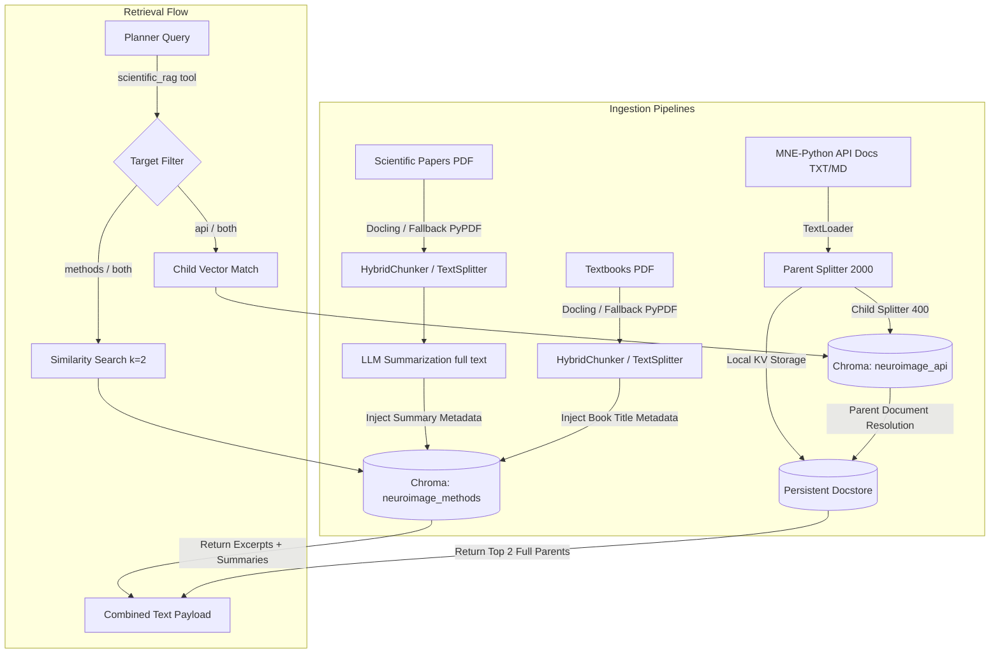

# EEG-ADK Multi-Agent System

This repository implements a multi-agent AI system designed to automate processing, filtering, and reporting workflows for EEG data. It utilizes a state-graph orchestration framework (LangGraph) combined with a sandbox container to run MNE-Python code. The system provides a command-line interface (CLI) and a web-based dashboard (React/Next.js).

---

## Architecture Overview

The system consists of three agents cooperating via a shared, persistent state and orchestrated as containerized services:

```mermaid
graph TD
    subgraph Host Machine / Client Browser
        Browser["EEG-ADK Analysis Studio<br/>(React / Next.js Client on Port 3000)"]
        HostData["Raw Data Directory<br/>(./data)"]
        HostOut["Outputs Directory<br/>(./output)"]
        HostLogs["State Database / Checkpoints<br/>(./logs)"]
    end

    subgraph Containerized Services (Docker Compose Network)
        Frontend["frontend Container<br/>(Node 20 / Next.js Server)"]
        Backend["backend Container<br/>(Python 3.10 / FastAPI Server)"]
        Sandbox["sandbox Container<br/>(Jupyter Kernel Gateway)"]
        Chroma["chromadb Container<br/>(Chroma DB Store)"]
    end

    Browser -->|HTTP / WebSockets| Frontend
    Browser -->|REST API / WebSockets (Port 8000)| Backend
    Backend -->|REST / WebSocket (Port 8888)| Sandbox
    Backend -->|Local FS Read/Write| Chroma

    HostData -->|Mounted read-only| Backend
    HostData -->|Mounted read-only| Sandbox
    HostOut -->|Mounted read-write| Backend
    HostOut -->|Mounted read-write| Sandbox
    HostLogs -->|Mounted read-write| Backend
```

### 1. Agents
* **Planner:** Parses user directives and generates an MNE-Python processing plan. It utilizes the **Dataset Explorer**, **Metadata Extractor**, or **BIDS Inspector** to extract dataset info, channels, and triggers. It references the **Scientific RAG** tool to lookup processing parameters from neuroimaging papers and textbooks.
* **Executor:** Generates and executes Python code matching the approved plan. It runs the code inside the **Sandbox** container (via Jupyter Kernel Gateway). It uses memory-safe options (`preload=False`, `gc.collect()`, `plt.close('all')`) to manage memory. In case of errors, it retries up to 5 times using error tracebacks and RAG or Web Search (DuckDuckGo).
* **Critic:** A Vision-Language Model (VLM) that audits code correctness, memory constraints, and output plots (checking for artifacts and signal quality). It approves the output or rejects it back to the Executor with feedback.

### 2. Interfaces
* **FastAPI Backend Server (`src/web/server.py`):** Serves API endpoints for file browsing, session creation, and state updates. It streams logs and plots to the client via WebSockets and handles plan approvals. It connects to the SQLite state database (`logs/checkpoints.sqlite`) to enable session hydration.
* **Next.js UI (`ui/`):** A web-based workspace. Powered by `assistant-ui`, it provides:
  * A file browser matching the mounted data folder.
  * A chat interface to start runs and display agent logs, errors, and plots.
  * Interactive cards to review, approve, or request revisions to the Planner's plan.
  * List and view of past completed runs.

---

## RAG Database Architecture

The system uses ChromaDB alongside a local filesystem key-value store to lookup parameters and API usage:



#### 1. Scientific Papers (`rag_docs/articles/`)
* **Purpose:** Supplies experimental design details (frequencies, epoch offsets, ICA details).
* **Ingestion:** Parsed via IBM Docling (fallback to standard loaders). Chunks are tagged with a global summary generated by the LLM.
* **Retrieval:** Combines matched chunks and the global summary to provide context to the Planner.

#### 2. Reference Textbooks (`rag_docs/books/`)
* **Purpose:** Supplies theoretical concepts and formulas.
* **Ingestion:** Split into 2,000-character chunks and tagged with the textbook title.

#### 3. API Documentation (`rag_docs/mne_python_docs/`)
* **Purpose:** Supplies MNE class, function signatures, and examples.
* **Parent-Child Indexing:** Child chunks (400 characters) are embedded in `neuroimage_api` for similarity search, resolving to the full parent chunks (2,000 characters) stored in a local directory (`chroma_data/docstore/`).

---

## Prerequisites

* **Docker** and **Docker Compose**
* **Python 3.10+** (if running commands directly on the host)
* **Google Gemini API Key** (configured as an environment variable in `.env`)

---

## Quickstart Data Setup

Before running the application, you need to populate the `./data` directory with your EEG datasets. The directory structure must match the following guidelines:

### A. Directory Structure
* **Single EEG Files**: Place files (e.g., `.fif`, `.edf`, `.bdf`, `.set`) directly inside the `./data` folder on your host:
  ```text
  ./data/
  ├── sample.fif
  └── recording.edf
  ```
* **BIDS Datasets**: Must be placed in their own subdirectories inside `./data`. A BIDS directory is automatically identified if it contains a `dataset_description.json` and subject folders starting with `sub-`:
  ```text
  ./data/
  └── ds004408/
      ├── dataset_description.json
      ├── participants.tsv
      ├── sub-001/
      │   └── eeg/
      │       ├── sub-001_task-listening_run-01_eeg.vhdr
      │       ├── sub-001_task-listening_run-01_eeg.vmrk
      │       └── sub-001_task-listening_run-01_eeg.eeg
      └── sub-002/
  ```

### B. Getting Sample Data
For testing, you can download:
1. **MNE-Python Sample Dataset**: A standard single-subject recording (`sample_audvis_raw.fif`) can be downloaded using MNE-Python's built-in downloader or directly from [MNE's sample data repository](https://mne.tools/stable/overview/datasets_index.html#sample).
2. **BIDS Auditory Dataset (ds004408)**: You can fetch the auditory BIDS dataset using Datalad (`datalad install https://github.com/OpenNeuroDatasets/ds004408.git`) or download it directly from [OpenNeuro](https://openneuro.org/datasets/ds004408).

---

## Preparing the Knowledge Base (RAG Ingestion)

The system relies on an offline Chroma DB instance populated with academic papers, textbooks, and MNE documentation. The Docker stack mounts the host-side `./chroma_data` directory. If it is empty, the agents will not have access to best-practice research parameters or API syntax.

1. **Verify Source Documents**:
   The raw source documents are already pre-loaded in the repository:
   * **Scientific Articles**: `rag_docs/articles/` (PDFs)
   * **Reference Textbooks**: `rag_docs/books/` (PDFs)
   * **MNE API Reference**: `rag_docs/mne_python_docs/` (TXT/MD)

2. **Configure Environment Credentials**:
   Ensure you have a `.env` file in the root directory with a valid Gemini key (used for embeddings and summarization):
   ```env
   GOOGLE_API_KEY=your_gemini_api_key_here
   ```

3. **Run the Ingestion Script**:
   Install the local package on your host and execute the ingestion script to process the documents and create the `./chroma_data` database:
   ```bash
   pip install -e .
   python scripts/ingest_rag_data.py
   ```
   *Note: Ingestion uses layout-aware chunking and LLM summarization. It may take several minutes depending on your internet connection and API rate limits.*

---

## Setup & Installation

### A. Run via Docker Compose (Recommended)
This method launches all services together using containerized environments. It automatically mounts `./data` (read-only), `./output` (read-write), `./logs` (read-write), and `./chroma_data` (read-write).

1. **Configure Environment Variables**:
   Create a `.env` file in the root directory:
   ```env
   GOOGLE_API_KEY=your_gemini_api_key_here
   EEG_DATA_DIR=./data
   ```
2. **Start Services**:
   Execute the boot command from the root directory:
   ```bash
   docker compose -f docker/docker-compose.yml up -d --build
   ```
   * **Web Dashboard**: Access at [http://localhost:3000](http://localhost:3000)
   * **API Backend**: Runs on [http://localhost:8000](http://localhost:8000)
   * **Chroma DB**: Runs internally, exposing port `8001` on host.
   * **Jupyter Sandbox**: Runs internally on port `8888`.

### B. Run via Local Workstation (Development Mode)
If you want to run the python backend components or Next.js dev server outside of Docker:

1. **Install Python Package and Web/Dev Dependencies**:
   ```bash
   # Core agents and sandbox interfaces
   pip install -e .
   # FastAPI web bridge dependencies
   pip install -r requirements-web.txt
   # (Optional) Dev dependencies for unit tests
   pip install -r requirements-dev.txt
   ```
2. **Start Sandbox Container**:
   The code must execute within the isolated Docker sandbox. Boot only the sandbox container:
   ```bash
   cd docker
   docker compose up -d sandbox
   ```
3. **Start FastAPI Backend**:
   Run the development web server on the host:
   ```bash
   python -m uvicorn src.web.server:app --reload --host 127.0.0.1 --port 8000
   ```
4. **Start Frontend Dev Server**:
   ```bash
   cd ui
   npm install
   npm run dev
   ```
   Open [http://localhost:3000](http://localhost:3000) to view the application.

5. **Run Tests**:
   ```bash
   pytest
   ```

---

## Usage Instructions

### Web Interface
1. Navigate to [http://localhost:3000](http://localhost:3000).
2. Select your file/directory in the file browser.
3. Write your analysis directive (e.g. *"Realign recordings to start/stop triggers and calculate average frequency spectra"*).
4. Select a past Run ID to reference if needed, and click **Start Analysis**.
5. When the plan is ready, review it in the **Plan Review** card: click **Approve** to execute or type feedback and click **Request Changes**.
6. View the logs and Matplotlib plots on the page.

### Command-Line Interface (CLI)
1. Run the terminal command:
   ```bash
   eeg-agent
   ```
2. Enter your relative file path and directive.
3. Type adjustments or press `ENTER` to approve the printed plan.

---

## Persistence & Outputs

Each completed run persists the following files inside `output/{thread_id}/`:
* `analysis_pipeline.py`: A compiled MNE-Python script containing the successful code blocks.
* `final_report.md`: Markdown report documenting metadata, RAG queries, sandbox code executions, logs, and Critic QA.
* `run_memory.json`: Structured run metadata containing parameters and results.
* Generated Figures: Matplotlib plots saved as PNG/JPEG files.

---

## Inspecting Past Runs
Run the inspection script from the host workstation:

* **List runs**:
  ```bash
  python scripts/inspect_run.py --list
  ```
* **Interactive inspect**:
  ```bash
  python scripts/inspect_run.py
  ```
* **Inspect specific thread**:
  ```bash
  python scripts/inspect_run.py -t <thread_id>
  ```
* **Show plan details**:
  ```bash
  python scripts/inspect_run.py -t <thread_id> --show-plan
  ```

---

## Technical Constraints & Safety
* **Pathing**: Files must be relative to the `./data` directory (e.g., `ds004408/sub-001/...`). Absolute host paths cannot be resolved by the sandbox.
* **Volume Mapping**: Ensure permissions allow the containers to write to `./output` and `./logs`.
