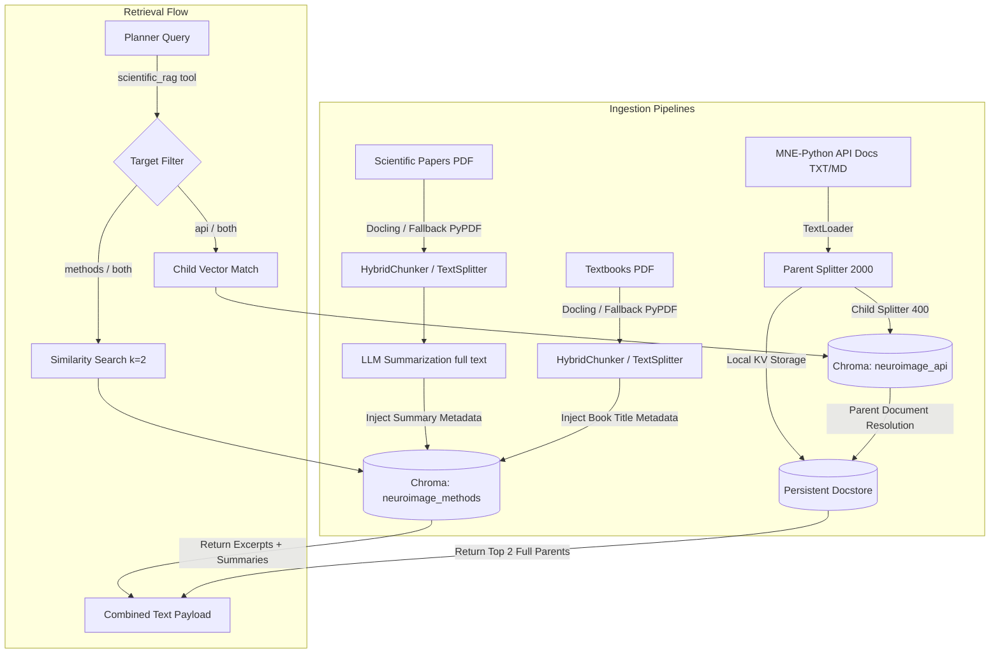

# Actionable EEG-ADK Multi-Agent System

This project is a multi-agent AI framework designed to automate the processing, filtering, and reporting of EEG data. By leveraging a state-graph architecture (LangGraph) and a memory-safe Docker Sandbox, it can flexibly react to variations in user instructions, data formats, and processing tools.

## Architecture Overview

The system operates via three LLM agents interacting through a shared state:

1. **Planner (Strategist):** Translates your natural language directives into a concrete MNE-Python pipeline. It uses a **Metadata Extractor** tool (for single files) or a **BIDS Inspector** tool (for directories and BIDS datasets) to inspect datasets without loading massive binary arrays into memory, and a **Scientific RAG** tool to autonomously fill in missing parameters (like standard bandpass frequencies for specific paradigms).
2. **Executor (Programmer):** Writes memory-safe Python code based on the Planner's blueprint and executes it inside a **Stateful Jupyter Sandbox** (with access to `mne-bids`). For multi-subject/cohort tasks, it executes subject-level loops, saving intermediate results and aggressively clearing memory (`gc.collect()` and `plt.close('all')`). If an error occurs, it recursively reads the traceback and patches the code up to 5 times.
3. **Critic (Reviewer):** A Multimodal Vision-Language Model that visually inspects the plots generated by the Executor. It ensures signal-to-noise ratio is adequate, rejects artifacts (like persistent eye-blinks), and drafts the final manuscript-ready Methods and Results section.
4. **Persistent Checkpointing & Audit Logging:** Swaps volatile checkpoints with local SQLite storage (`logs/checkpoints.sqlite`). The system isolates runs under unique thread IDs and captures detailed RAG query histories and sandbox code executions.


### RAG Database Architecture

To support neuroscientific parameter lookup and syntax generation, the system utilizes a **Dual-Collection Vector Database (ChromaDB)** combined with a filesystem-backed key-value docstore. The ingestion, chunking, and retrieval flows are optimized specifically for each document category:



#### 1. Scientific Papers (`rag_docs/articles/`)
* **Purpose:** Provides the Planner with experimental design details, parameters (filter bounds, epochs, ICA details), and paradigm-specific heuristics.
* **Ingestion & Chunking:** Loaded and parsed layout-aware via **IBM Docling** and chunked at paragraph/section level using **HybridChunker** (with config-based `chunk_size` tokens). Features a robust fallback to `PyPDFLoader` + `RecursiveCharacterTextSplitter` if Docling is unavailable.
* **Summarization:** The full text reconstructed from all chunks is processed by the LLM (Gemini) to generate a concise, structured global summary of the methodologies, parameters, and findings.
* **Storage & Metadata:** The global summary, section titles (headings path), and page numbers are injected into the metadata of **every chunk** of that paper. The chunks are embedded and indexed in the `neuroimage_methods` collection.
* **Retrieval Flow:** 
  1. A similarity search (`k=2`) matches the query against the paper chunks.
  2. The returned payload merges both the specific matching text chunk (e.g., specific filter descriptions) and the **Global Summary** from the metadata.
  3. This ensures the Planner understands both the specific text passage and the broad experimental design parameters.

#### 2. Reference Textbooks (`rag_docs/books/`)
* **Purpose:** Provides the Planner with fundamental signal processing principles, math formulas, and statistical standards.
* **Ingestion & Chunking:** Loaded via `PyPDFLoader` and split into larger chunks of **2,000 characters** (300 overlap) to keep mathematical and physiological concepts contiguous.
* **Storage & Metadata:** To avoid massive token usage and rate limits, textbooks are not LLM-summarized. Instead, the book's filename/title is injected as the global summary metadata along with `source_type = 'Book'`. The chunks are indexed in the `neuroimage_methods` collection.
* **Retrieval Flow:** Operates as a standard similarity search (`k=2`), returning matching theoretical blocks and referencing the source textbook title.

#### 3. MNE-Python API Documentation (`rag_docs/mne_python_docs/`)
* **Purpose:** Ensures the Executor has access to accurate code syntax, parameters, default configurations, and API examples to write bug-free Python code.
* **Ingestion & Hierarchical Chunking:** Text/Markdown files are processed using a **Hierarchical Parent-Child Indexing** strategy via LangChain's `ParentDocumentRetriever`:
  * **Parent Chunks:** Split into structural blocks of **2,000 characters** (200 overlap).
  * **Child Chunks:** Sub-split into tiny, high-granularity blocks of **400 characters** (50 overlap).
* **Storage:** 
  * The small **child chunks** are embedded and indexed in the `neuroimage_api` collection in ChromaDB.
  * The large **parent documents** are stored in a local key-value store (`chroma_data/docstore/` using `LocalFileStore`).
* **Retrieval Flow:**
  1. A search query (e.g., `mne.Epochs parameters`) is run against the tiny child chunks (`neuroimage_api`), yielding extremely high matching accuracy due to the low noise level of small text blocks.
  2. Once matched, the retriever uses the child chunk's pointer to resolve and fetch the complete **parent document** (up to 2,000 characters) from the local key-value `docstore`.
  3. Capped at the top 2 parent matches to preserve LLM token limits, this guarantees the Executor receives a complete, unbroken code description and parameter signature, rather than a fragmented snippet of a code block.

---


## Prerequisites

- **Python 3.10+**
- **Docker** & **Docker Compose**
- **NVIDIA GPU** (Recommended for local LLMs and rapid EEG processing)
- Local EEG Data files (e.g., `.fif`, `.set`, `.vhdr`)

---

## Setup & Installation

### 1. Install Dependencies
Install the required orchestration packages on your host machine:
```bash
pip install -r requirements.txt
```

### 2. Configure Settings & Environment Variables

The project separates configuration parameters (models, chunking sizes, retrieval sizes, sandbox endpoints, retry limits) from environment credentials and API keys.

#### Centralized Configuration (`config.json`)
All non-sensitive model configurations, chunking thresholds, and pipeline options are stored in `config.json` at the root of the project. This makes parameters easily discoverable and adjustable:

```json
{
  "llm_provider": "gemini",
  "gemini_model": "gemini-3.5-flash",
  "vllm_api_base": "http://localhost:8000/v1",
  "vllm_api_key": "EMPTY",
  "vllm_model": "mistralai/Mixtral-8x7B-Instruct-v0.1",
  "vlm_model": "llava-hf/llava-1.5-7b-hf",
  
  "embedding_provider": "local",
  "embedding_model": "BAAI/bge-small-en-v1.5",
  
  "ingestion": {
    "articles": {
      "chunk_size": 1500,
      "chunk_overlap": 300,
      "summary_max_chars": 10000
    },
    "books": {
      "chunk_size": 2000,
      "chunk_overlap": 300
    },
    "api_docs": {
      "parent_chunk_size": 2000,
      "parent_chunk_overlap": 200,
      "child_chunk_size": 400,
      "child_chunk_overlap": 50
    }
  },
  
  "retrieval": {
    "methods_k": 2,
    "api_k": 2
  },
  
  "sandbox": {
    "gateway_url": "http://localhost:8888",
    "ws_gateway_url": "ws://localhost:8888",
    "jupyter_token": "eeg_adk_sandbox_token"
  },
  
  "planner": {
    "temperature": 0.0
  },
  
  "executor": {
    "max_retries": 5
  }
}
```

#### Secrets & Environment Variables (`.env`)
Create a `.env` file in the root directory to store sensitive credentials and/or local machine overrides.

**Example `.env` (Using Gemini):**
```env
# Gemini Credentials
GOOGLE_API_KEY=your_gemini_api_key_here

# Optional: Override provider for local session overrides
# LLM_PROVIDER=gemini
# EMBEDDING_PROVIDER=local
```

**Example `.env` (Using Local vLLM):**
```env
# Local Server Override Keys
VLLM_API_KEY=your_vllm_key_here
```

Any variables set in the `.env` file (or exported to the shell environment) will take precedence over `config.json` values to allow seamless override control.

### 3. Start the Docker Sandbox
The Executor agent requires the isolated Docker container to safely execute generated MNE/EEGLAB code without crashing your host machine.
```bash
cd docker
docker-compose up -d --build
```
*Note: This image includes MATLAB Runtime, EEGLAB, and MNE-Python, so the initial build may take some time.*

### 4. Prepare the Knowledge Base (RAG)
For the Planner and Executor agents to intelligently infer standard EEG parameters and use the MNE API correctly, you should populate the Vector Database:
1. Place standard methodology papers (e.g., P300/N400 processing guidelines) as **PDF** files and official MNE-Python API documentation as **Markdown/TXT** files into the newly created `rag_docs/` directory at the root of the project.
2. Run the ingestion script:
   ```bash
   python scripts/ingest_rag_data.py
   ```
This will automatically parse, chunk, and embed the documents into the local ChromaDB.

---

## Usage Instructions

### 1. Prepare Your Data
To maintain security and path consistency with the Docker Sandbox, **all EEG data must be placed inside the `data/` directory** located at the root of the project.
* For single files:
  ```bash
  mkdir -p data
  cp /path/to/your/eeg_recording.fif ./data/
  ```
* For BIDS datasets:
  ```bash
  mkdir -p data
  cp -r /path/to/your/bids_dataset ./data/
  ```

### 2. Run the Multi-Agent Workflow
Execute the main entrypoint:
```bash
PYTHONPATH=. .venv/bin/python main.py
```

### 3. The Human-In-The-Loop (HITL) Process
1. **Ingestion:** The system will prompt you for the filename or folder path of your data (relative to the `data/` directory) and your high-level directive (e.g., *"Filter 1-30Hz, apply ICA, and epoch on trigger 'Stimulus/1'"* or for cohort: *"Compute grand average ERP over all subjects for task 'P300'"*).
2. **Review Plan:** The Planner will generate a Markdown plan. Execution will pause.
3. **Approve/Edit:** Press `ENTER` to approve the plan and pass it to the Executor, or type corrective feedback to dynamically adjust the pipeline.
4. **Execution, Session Persistence & Final Audit:** The Executor will run the code in the Docker sandbox, and the Critic will review the output plots. Session checkpoints are persistently saved to `logs/checkpoints.sqlite`. Upon run completion, the system automatically compiles all successful code blocks into a standalone, reproducible python script (`output/analysis_pipeline.py`) and generates a detailed audit report (`output/final_report.md`) containing the metadata, RAG retrieval audit log, sandbox code execution traces, and critic QA reviews.


---

## Known Limitations
- **Data Pathing:** Do not provide absolute paths from your host machine (e.g., `/home/user/data.set`). The Docker container cannot access them. Only provide paths relative to the `data/` directory.
- **RAG Vector Database:** The `chromadb` instance must be populated with research PDFs to fully utilize the `scientific_rag` tool. Currently, if no documents match, the agent falls back to its foundational heuristic knowledge.
